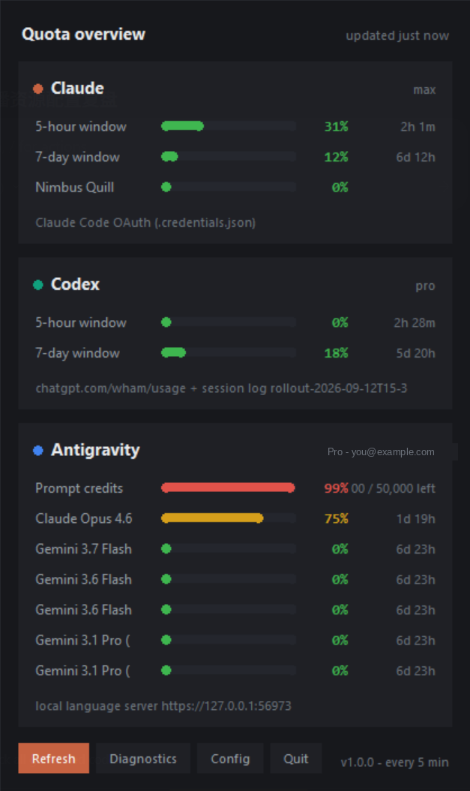

<h1 align="center">QuotaTray</h1>

<p align="center">
  A Windows 11 tray app that shows your <b>Claude</b>, <b>Codex</b> and
  <b>Antigravity IDE</b> quota in one click.<br>
  <sub>Windows 11 托盘小程序，一键查看 Claude / Codex / Antigravity IDE 的额度用量。</sub>
</p>

<p align="center">
  <a href="../../actions/workflows/build.yml"></a>
  <a href="../../actions/workflows/test.yml"></a>
  <a href="LICENSE"></a>
  <a href="../../releases/latest"></a>
</p>

<p align="center">
  
</p>

<p align="center"><b>English</b> · <a href="#chinese">中文说明</a></p>

---

## What it does

It sits in the notification area, starts with Windows, and draws one usage bar
per product. Click it and you get every quota window, how much is used, and how
long until each resets.

No sign-in. It reads credentials that already exist on your machine from
whichever tool put them there, and every product has **several fallback paths**
so it keeps working when one of them is unavailable.

## Install

### Option 1 — the executable (no Python needed)

Download from the [latest release](../../releases/latest):

| File | When to use it |
|---|---|
| `QuotaTray.exe` | Single file. Simplest. |
| `QuotaTray-portable.zip` | Unzip and run `QuotaTray.exe` inside. Starts faster and is less likely to trip antivirus. |
| `SHA256SUMS.txt` | Verify what you downloaded (see below). |

Put it where it will live (for example `C:\Tools\QuotaTray\`) **before** the
first run — the first launch writes that path into run-at-login.

> **Antivirus false positives.** This app reads the Chromium cookie database,
> calls DPAPI and scans process command lines. Those are exactly the behaviours
> heuristic scanners flag, and the release binaries are not code-signed, so
> Defender / 360 / Huorong may block them. That is a false positive, but you
> should not take my word for it — the binaries are built by
> [GitHub Actions](../../actions/workflows/build.yml) from this repository, in a
> public log you can read, and each release ships SHA256 sums. If you would
> rather not run an unsigned binary at all, use option 2.

Verify a download:

```powershell
Get-FileHash .\QuotaTray.exe -Algorithm SHA256
# compare with SHA256SUMS.txt from the same release
```

### Option 2 — from source

```powershell
git clone https://github.com/OWNER/QuotaTray.git
cd QuotaTray
.\install.bat
```

`install.bat` creates a virtualenv, installs the dependencies, starts the app
and enables run-at-login. You need Python 3.10+ with **tcl/tk and IDLE** ticked
during setup (the panel uses tkinter):

```powershell
winget install Python.Python.3.12
```

## The scripts

| File | What it does |
|---|---|
| `install.bat` | Create the venv, install deps, start, enable run-at-login |
| `run.bat` | Start it manually |
| `diagnose.bat` | **Start here when something is wrong** — prints every source probe |
| `probe.bat` | Writes `_probe.txt` with proxy config, raw API payloads and discovery output (secrets redacted) |
| `preview.bat` | Draw the panel with fake data to check the UI renders |
| `claude_login.bat` | Start Claude Code with the proxy port forced to a known-good value |
| `build_exe.bat` | Build `dist\QuotaTray.exe` locally |
| `publish.bat` | Create the GitHub repository and push (one-time) |
| `release.bat` | Tag a version, which builds and publishes a release |
| `fix_push.bat` | Retry a failed push with the full error shown |
| `find_gh.bat` | Locate git/gh when a stale PATH hides them |
| `uninstall.bat` | Remove run-at-login, stop the process, optionally delete config |

## Where the numbers come from

### Claude

| Order | Source |
|---|---|
| 1 | OAuth token from `~/.claude/.credentials.json` → `api.anthropic.com/api/oauth/usage` |
| 2 | `sessionKey` decrypted out of Claude Desktop's Electron cookie store → `claude.ai` usage endpoints |
| 3 | `session_key` pasted into `config.json` |

Path 1 searches the `CLAUDE_CODE_OAUTH_TOKEN` env var, `CLAUDE_CONFIG_DIR`,
`~/.claude`, `%APPDATA%\Claude`, `%LOCALAPPDATA%\Claude`, **and every WSL
distro's `~/.claude`** — plenty of people only ever signed in inside WSL.
Claude Desktop and Claude Code draw from the same subscription pool, so these
numbers are the budget the desktop app spends too.

### Codex

| Order | Source |
|---|---|
| 1 | access_token from `~/.codex/auth.json` → `chatgpt.com/backend-api/wham/usage` |
| 2 | `codex app-server` + JSON-RPC `account/rateLimits/read` |
| 3 | `~/.codex/sessions/**/rollout-*.jsonl` scanned backwards for `rate_limits` |
| 4 | sqlite files under `~/.codex` |

Codex **merges** across sources instead of stopping at the first hit: the live
endpoint sometimes reports only one of the two windows, so the next source fills
in the gap. Window names are matched loosely (`primary`, `primary_window`,
`primaryWindow` are the same thing), and a window's real length beats its key
name — a "primary" window whose reset is five days out is relabelled as the
weekly one.

### Antigravity IDE

Antigravity runs a language server launched with `--csrf_token`, listening on a
random port on `127.0.0.1`. QuotaTray reads that token and port off the running
process, then calls the server's local Connect RPC `GetUserStatus` for the
prompt-credit balance and each model's remaining quota. Nothing leaves your
machine. **The IDE has to be open**, otherwise the panel says "IDE not running".

## Configuration

`%APPDATA%\QuotaTray\config.json` (tray menu → *Open config file*). Restart to apply.

```jsonc
{
  "refresh_seconds": 300,          // minimum 60
  "hide_not_installed": true,      // skip products that aren't installed
  "warn_percent": 75,              // amber threshold
  "danger_percent": 90,            // red threshold
  "icon_style": "bars",            // "bars" or "ring"
  "providers": {
    "claude": {
      "enabled": true,
      "percent_scale": "auto",     // auto / percent / fraction
      "oauth_token": "",           // manual fallbacks
      "session_key": "",
      "credentials_path": "",
      "scan_wsl": true,
      "order": ["oauth", "desktop_cookie", "manual_cookie"]
    },
    "codex": {
      "enabled": true,
      "codex_home": "",
      "order": ["wham", "app_server", "jsonl", "sqlite"]
    },
    "antigravity": {
      "enabled": true,
      "csrf_token": "",
      "port": 0,
      "show_models": true,
      "max_models": 6
    }
  }
}
```

Set `enabled` to `false` to skip a product. Edit `order` to change the fallback
sequence or drop a path entirely — for example remove `app_server` if you would
rather not spawn a process on every refresh.

## Troubleshooting

Run **`diagnose.bat`** first. It prints the outcome of every source:

```
=== Claude [max] ===
  status: connected
  source: Claude Code OAuth (.credentials.json)
  5-hour window         31%   resets in 2h 1m
  7-day window          12%   resets in 6d 12h
    [OK] OAuth credentials: C:\Users\you\.claude\.credentials.json
```

| Symptom | Fix |
|---|---|
| Every Claude source FAILs | Run `claude` once so it refreshes the token |
| `token expired` | Same — using Claude Code renews it automatically |
| `App-Bound encryption (v20)` | Newer Electron cookies can't be decrypted; use Claude Code credentials or paste a `session_key` into config |
| Codex "offline snapshot" | It fell through to the session-log path. Run `codex` once |
| Codex "partly from an offline snapshot" | The live endpoint reported only one window; the other came from the log. Normal |
| Antigravity "IDE not running" | Open the IDE, then *Refresh now* in the tray menu |
| Claude Code can't reach your proxy | Edit `PROXY_PORT` at the top of `claude_login.bat`, run it, then `/login` |
| No tray icon | Look under the taskbar `^` arrow; check `%APPDATA%\QuotaTray\quota-tray.log` |
| Panel missing / tkinter error | Python was installed without tcl/tk — reinstall it |
| A percentage looks wrong | Set that provider's `percent_scale` from `auto` to `percent` |

Log: `%APPDATA%\QuotaTray\quota-tray.log` · Snapshot: `%APPDATA%\QuotaTray\diagnostics.txt`

## Privacy

- Credentials are used only in HTTP `Authorization` / `Cookie` headers. Never logged, never written to disk, never sent anywhere else.
- The only hosts contacted are `api.anthropic.com`, `claude.ai`, `chatgpt.com` and `127.0.0.1`.
- Every network call lives in the three files under `quota_tray/providers/`, so the whole surface is short enough to read.
- `probe.bat` redacts tokens and cookies before writing its report, but `_probe.txt` still contains local paths — do not paste it publicly without a look.

## Development

```powershell
python tests\test_providers.py    # 37 offline checks, no network needed
```

The suite drives all three fallback chains with fabricated payloads, covering
HTTP 401 degradation, both percent conventions (0–1 and 0–100), loose window-key
matching, cross-source merging, the IDE-not-running path, cache round-trips and
countdown formatting.

Releases are cut by tagging. Use `release.bat`, which checks that the workflow
is actually committed first (tagging a commit without it builds nothing),
commits anything pending, pushes the tag and then watches the run:

```powershell
.\release.bat
```

Or by hand:

```powershell
git tag v1.0.1
git push origin v1.0.1
```

Either way the [build workflow](.github/workflows/build.yml) attaches the
executable, the portable zip and the SHA256 sums to the release.

## Known limitations

- These are **undocumented internal endpoints**. Vendors can change them at any time. The parsers hunt recursively for `utilization` / `used_percent` fields rather than fixed paths, so a reshuffled envelope still parses — and if one truly breaks, `diagnose.bat` names it.
- Antigravity needs the IDE running.
- The Codex session-log fallback is a snapshot, not live data.
- The release binaries are unsigned. See the antivirus note above.

## License

MIT — see [LICENSE](LICENSE).

---

<a id="chinese"></a>

<p align="center"><a href="#quotatray">English</a> · <b>中文说明</b></p>

## 这是什么

一个常驻 Windows 11 通知区域、开机自启的小程序，把每个产品的用量画成一条进度条。点开面板能看到每个额度窗口用了多少、还有多久重置。

**不需要登录**。它读取你机器上各个工具已经写好的凭据，而且每个产品都有**多条兜底路径**，某一条不通时自动换下一条。

## 安装

### 方式一：直接用 exe（不需要 Python）

从 [最新 Release](../../releases/latest) 下载：

| 文件 | 什么时候用 |
|---|---|
| `QuotaTray.exe` | 单文件，最省事 |
| `QuotaTray-portable.zip` | 解压后运行里面的 `QuotaTray.exe`。启动更快，也更不容易被杀软误报 |
| `SHA256SUMS.txt` | 校验下载的文件（见下） |

**第一次运行前**先把它放到最终位置（比如 `C:\Tools\QuotaTray\`）—— 首次启动会把当时的路径写进开机自启。

> **关于杀软误报**。这个程序会读 Chromium 的 cookie 数据库、调用 DPAPI、扫描进程命令行 —— 这几样正好是启发式扫描重点盯的行为，而且 Release 里的二进制没有代码签名，所以 Defender / 360 / 火绒有可能拦它。这是误报，但你不该只听我一面之词：二进制全部由 [GitHub Actions](../../actions/workflows/build.yml) 基于本仓库构建，构建日志公开可查，每个 Release 都附 SHA256。如果你就是不想跑未签名的程序，走方式二。

校验下载：

```powershell
Get-FileHash .\QuotaTray.exe -Algorithm SHA256
# 和同一个 Release 里的 SHA256SUMS.txt 对一下
```

### 方式二：从源码运行

```powershell
git clone https://github.com/OWNER/QuotaTray.git
cd QuotaTray
.\install.bat
```

`install.bat` 会建虚拟环境、装依赖、启动程序并写入开机自启。需要 Python 3.10+，安装时**务必勾选 tcl/tk and IDLE**（面板用的是 tkinter）：

```powershell
winget install Python.Python.3.12
```

## 各个脚本

| 文件 | 作用 |
|---|---|
| `install.bat` | 建虚拟环境、装依赖、启动、写开机自启 |
| `run.bat` | 手动启动 |
| `diagnose.bat` | **出问题先跑这个** —— 打印每条采集路径的探测结果 |
| `probe.bat` | 把代理配置、原始 API 响应、进程探测输出写进 `_probe.txt`（已脱敏） |
| `preview.bat` | 用假数据画一次面板，确认界面正常 |
| `claude_login.bat` | 用指定的代理端口启动 Claude Code，方便登录 |
| `build_exe.bat` | 本地打包出 `dist\QuotaTray.exe` |
| `publish.bat` | 建 GitHub 仓库并推送（只需一次） |
| `release.bat` | 打版本 tag，自动构建并发布 Release |
| `fix_push.bat` | push 失败时重试，并显示完整错误 |
| `find_gh.bat` | PATH 没刷新导致找不到 git/gh 时定位它们 |
| `uninstall.bat` | 移除开机自启、结束进程、可选删除配置 |

## 额度是从哪里读的

### Claude

| 顺序 | 来源 |
|---|---|
| 1 | `~/.claude/.credentials.json` 里的 OAuth token → `api.anthropic.com/api/oauth/usage` |
| 2 | 从 Claude Desktop 的 Electron cookie 库解出 `sessionKey` → `claude.ai` 用量接口 |
| 3 | 在 `config.json` 里手填的 `session_key` |

第 1 条会搜索：环境变量 `CLAUDE_CODE_OAUTH_TOKEN`、`CLAUDE_CONFIG_DIR`、`~/.claude`、`%APPDATA%\Claude`、`%LOCALAPPDATA%\Claude`，**以及每个 WSL 发行版下的 `~/.claude`** —— 很多人只在 WSL 里登录过。Claude Desktop 和 Claude Code 共用同一个订阅额度池，所以这里的数字就是桌面端也在消耗的那份。

### Codex

| 顺序 | 来源 |
|---|---|
| 1 | `~/.codex/auth.json` 的 access_token → `chatgpt.com/backend-api/wham/usage` |
| 2 | `codex app-server` 的 JSON-RPC `account/rateLimits/read` |
| 3 | 倒着扫 `~/.codex/sessions/**/rollout-*.jsonl` 里的 `rate_limits` |
| 4 | `~/.codex` 下的 sqlite 文件 |

Codex 会**跨来源合并**，而不是拿到第一个结果就停：线上接口有时只返回两个窗口中的一个，缺的那个由下一条来源补上。窗口名做模糊匹配（`primary`、`primary_window`、`primaryWindow` 算同一个），并且**窗口的实际长度优先于键名** —— 一个叫 primary 但重置时间在五天后的窗口，会被重新标成周窗口。

### Antigravity IDE

Antigravity 内部跑一个语言服务器，启动参数里带 `--csrf_token`，并在 `127.0.0.1` 上监听随机端口。QuotaTray 从运行中的进程读出 token 和端口，再调它本地的 Connect RPC `GetUserStatus`，拿到 prompt credits 余额和每个模型的剩余额度。**数据不出本机**。**IDE 必须开着**，关掉后面板会显示 "IDE not running"。

## 配置

配置在 `%APPDATA%\QuotaTray\config.json`（托盘菜单 → *Open config file*），改完重启生效。字段说明见上方英文部分的 JSON 注释，几个常用的：

- `refresh_seconds` — 刷新间隔，最小 60
- `warn_percent` / `danger_percent` — 变黄、变红的阈值
- `icon_style` — `bars`（三条用量条）或 `ring`（圆环）
- 每个 provider 的 `enabled` 改成 `false` 就不再采集它
- 每个 provider 的 `order` 可以调整兜底顺序，或者直接删掉某条路径（比如嫌 `app_server` 每次都要起进程）

## 排错

**先跑 `diagnose.bat`**，它会逐条打印每个来源的结果：

```
=== Claude [max] ===
  status: connected
  source: Claude Code OAuth (.credentials.json)
  5-hour window         31%   resets in 2h 1m
  7-day window          12%   resets in 6d 12h
    [OK] OAuth credentials: C:\Users\you\.claude\.credentials.json
```

| 现象 | 处理 |
|---|---|
| Claude 全部 FAIL | 在 cmd 里跑一次 `claude` 让它刷新 token |
| `token expired` | 同上，用一次 Claude Code 就会自动续期 |
| `App-Bound encryption (v20)` | 新版 Electron 的 cookie 解不开；改用 Claude Code 凭据，或把 `session_key` 填进配置 |
| Codex 显示 "offline snapshot" | 走的是会话日志兜底；跑一次 `codex` 会刷新 |
| Codex 显示 "partly from an offline snapshot" | 线上接口只返回了一个窗口，另一个来自日志。正常现象 |
| Antigravity 显示 "IDE not running" | 打开 IDE，然后在托盘菜单点 *Refresh now* |
| Claude Code 连不上你的代理端口 | 改 `claude_login.bat` 开头的 `PROXY_PORT`，运行它，再 `/login` |
| 托盘没图标 | 在任务栏 `^` 里找找；或看 `%APPDATA%\QuotaTray\quota-tray.log` |
| 面板不显示 / 报 tkinter | Python 安装时没勾 tcl/tk，重装 Python |
| 某个百分比明显不对 | 把该 provider 的 `percent_scale` 从 `auto` 改成 `percent` |

日志：`%APPDATA%\QuotaTray\quota-tray.log` · 诊断快照：`%APPDATA%\QuotaTray\diagnostics.txt`

## 隐私

- 凭据只用在 HTTP 的 `Authorization` / `Cookie` 头里，不写日志、不落盘、不发给任何第三方
- 只连这几个域：`api.anthropic.com`、`claude.ai`、`chatgpt.com`、`127.0.0.1`
- 所有网络请求都集中在 `quota_tray/providers/` 的三个文件里，整个面很小，可以自己读完
- `probe.bat` 生成报告时会脱敏 token 和 cookie，但 `_probe.txt` 里仍有本机路径，公开粘贴前先看一眼

## 开发

```powershell
python tests\test_providers.py    # 37 项离线测试，不需要联网
```

测试用伪造的响应跑通全部三条兜底链，覆盖 HTTP 401 降级、两种百分比口径（0–1 和 0–100）、窗口键名模糊匹配、跨来源合并、IDE 未运行、缓存往返和倒计时格式。

发布新版本靠打 tag。用 `release.bat` 更稳，它会先确认 workflow 确实在提交里（打了 tag 但仓库里没有 workflow 是不会有任何构建的），提交未保存的改动，推送 tag，然后盯着构建跑完：

```powershell
.\release.bat
```

或者手动：

```powershell
git tag v1.0.1
git push origin v1.0.1
```

两种方式都会触发 [构建工作流](.github/workflows/build.yml)，自动把 exe、便携版 zip 和 SHA256 附到 Release 上。

## 已知限制

- 这些都是各家的**内部接口**，没有公开文档，厂商随时可能改。解析器写成「递归查找 `utilization` / `used_percent` 字段」而不是写死路径，所以外层结构变了还能读；真失效了 `diagnose.bat` 会告诉你是哪条断的
- Antigravity 必须开着 IDE
- Codex 的会话日志兜底是快照，不是实时数据
- Release 里的二进制未签名，见上面关于杀软误报的说明

## 许可证

MIT，见 [LICENSE](LICENSE)。
