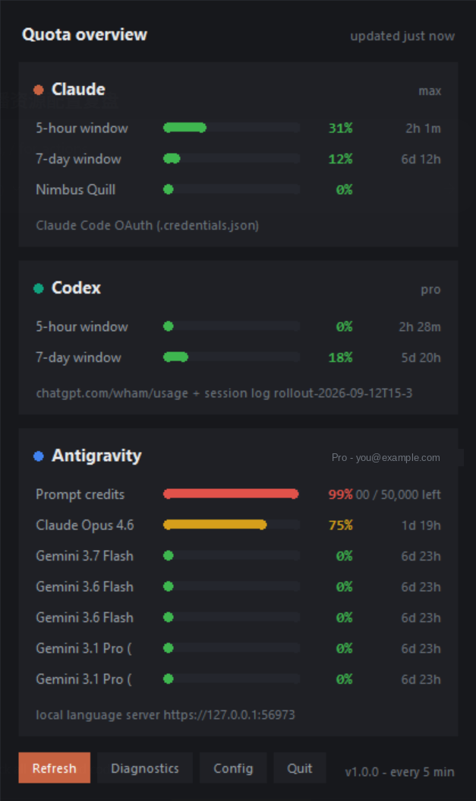

<h1 align="center">QuotaTray</h1>

<p align="center">
  A Windows 11 tray app that shows your <b>Claude</b>, <b>Codex</b> and
  <b>Antigravity IDE</b> quota in one click.<br>
  <sub>Windows 11 托盘小程序，一键查看 Claude / Codex / Antigravity IDE 的额度用量。</sub>
</p>

<p align="center">
  <a href="../../actions/workflows/build.yml"></a>
  <a href="../../actions/workflows/test.yml"></a>
  <a href="LICENSE"></a>
  <a href="../../releases/latest"></a>
</p>

<p align="center">
  
</p>

<p align="center"><b>English</b> · <a href="#chinese">中文说明</a></p>

> [!TIP]
> **Just want it running? Grab the 176 KB C# edition.**
> **[`QuotaTray-<version>-csharp-windows-anycpu.exe`](../../releases/latest)** is a
> **single 176 KB file: download it, double-click it, done.** No Python, no
> installer, no runtime to download (it uses the .NET Framework built into
> Windows 10/11), and it starts instantly. Same panel and data as the
> Python edition. See [the C# edition](#the-c-edition).
>
> **只想直接用？下载 176 KB 的 C# 版。**
> **[`QuotaTray-<版本>-csharp-windows-anycpu.exe`](../../releases/latest)**
> **只有一个 176 KB 的文件：下载、双击，就能运行。** 不用装 Python，不用安装程序，也不用额外下载运行库（用 Windows 10/11 自带的 .NET Framework），秒开。面板和数据与 Python 版一致，见 [C# 版](#c-版)。

---

## What it does

It sits in the notification area, starts with Windows, and draws one usage bar
per product. Click it and the panel (screenshot above) shows, per product:

- **Every quota window** with how much is used and how long until it resets:
  Claude's 5-hour and 7-day windows plus any extra limits the account has,
  Codex's windows, and Antigravity's prompt credits and per-model quotas.
- **Account details**: plan and status (a cancelled Claude plan shows amber),
  when the subscription started or renews, Claude extra usage, Codex credits.
- **Several accounts**: if Claude Code and Claude Desktop (or Windows and WSL
  Codex) are signed in to different accounts, the card gets ‹ › buttons,
  one page per account.
- **Banked limit resets**: the one-time resets Anthropic and OpenAI hand out,
  how many are unused and when the first one expires. A notification reminds
  you once a day while any are unused.
- **More products**: **Gemini CLI** (per-model quota and tier), **TRAE (Trae
  CN)** (plan and fast-request usage), and the **Doubao** desktop client
  (plan and window-limit usage).
- **Two tabs**: *Subscriptions* (Claude, Codex, Antigravity, Gemini CLI, TRAE,
  Doubao) and *Pay as you go*, where the **DeepSeek API balance** of the key
  that OpenCode or DeepSeek Harness (dsh) keeps is shown: total, topped up and
  granted, amber when it runs low. Each tab scrolls when its cards do not fit
  on the screen.

No sign-in. It reads credentials that already exist on your machine from
whichever tool put them there (including Claude Desktop's own login), and
every product has **several fallback paths** so it keeps working when one of
them is unavailable. New versions install from the tray menu in one click.

## Install

### Option 1 — the executable (no Python needed)

Download from the [latest release](../../releases/latest). There are two
editions with the same panel, data sources and settings; pick either one:

| File | Edition | When to use it |
|---|---|---|
| `QuotaTray-<version>-windows-x64.exe` | Python | Single file, ~15 MB. The original; has every fallback path. Rename it to `QuotaTray.exe` if you like; updates keep whatever name it has. |
| `QuotaTray-<version>-windows-x64-portable.zip` | Python | Unzip and run `QuotaTray.exe` inside. Starts faster and is less likely to trip antivirus. |
| **`QuotaTray-<version>-csharp-windows-anycpu.exe`** | **C#** | **Recommended. One 176 KB file, double-click to run**, starts instantly. Uses the .NET Framework 4.8 built into Windows 10/11, runs natively on x64 and ARM64. See [the C# edition](#the-c-edition). |
| `QuotaTray-<version>-SHA256SUMS.txt` | | Verify what you downloaded (see below). |

Only one QuotaTray runs at a time, whichever edition: both share the settings
in `%APPDATA%\QuotaTray`, and starting one replaces the other.

Every file carries the version and architecture, e.g.
`QuotaTray-v1.3.2-windows-x64.exe`. Releases before v1.3.2 used plain names.

Put it where it will live (for example `C:\Tools\QuotaTray\`) **before** the
first run — the first launch writes that path into run-at-login.

> **Antivirus false positives.** This app reads the Chromium cookie database,
> calls DPAPI and scans process command lines. Those are exactly the behaviours
> heuristic scanners flag, and the release binaries are not code-signed, so
> Defender / 360 / Huorong may block them. That is a false positive, but you
> should not take my word for it — the binaries are built by
> [GitHub Actions](../../actions/workflows/build.yml) from this repository, in a
> public log you can read, and each release ships SHA256 sums. If you would
> rather not run an unsigned binary at all, use option 2.

Verify a download:

```powershell
Get-FileHash .\QuotaTray-v1.3.2-windows-x64.exe -Algorithm SHA256
# compare with QuotaTray-v1.3.2-SHA256SUMS.txt from the same release
```

### Option 2 — from source

```powershell
git clone https://github.com/yhm138/ai-quota-tray.git
cd ai-quota-tray\python
.\install.bat
```

`install.bat` creates a virtualenv, installs the dependencies, starts the app
and enables run-at-login. You need Python 3.10+ with **tcl/tk and IDLE** ticked
during setup (the panel uses tkinter):

```powershell
winget install Python.Python.3.12
```

## Repository layout

| Folder | What is in it |
|---|---|
| `python/` | The Python edition: `quota_tray/` (the app), `tests/`, `tools/`, `run.pyw` and its `.bat` scripts |
| `csharp/` | The C# edition: `src/QuotaTray/` (the app) and `tests/QuotaTray.Tests/` |
| `scripts/` | Maintainer scripts: publishing, releases, the workflow generator |
| `update.ps1` | The stand-alone updater (stays at the root: older versions download it from there) |
| `docs/` | The screenshot |

## The C# edition

**A single 176 KB `.exe` you double-click to run.** The same app written in
C# for .NET Framework 4.8, which ships with Windows 10 (1903+) and 11, so
there is nothing to install and nothing to unpack: it starts instantly and
uses far less memory than the ~15 MB Python build.

It covers the same data: Claude (Claude Code logins, including WSL, and
Claude Desktop's own login), Codex (the live usage API with plan, credits and
resets, `codex app-server`, the session logs) and Antigravity, with the same
multi-account pages, reset reminder, one-click in-app update, diagnostics and
run-at-login. Not included: the claude.ai cookie fallbacks and the Codex SQLite
scan, which the Python edition keeps as last resorts.

Build it yourself with the .NET SDK (any OS can compile it):

```powershell
dotnet build csharp\src\QuotaTray\QuotaTray.csproj -c Release
dotnet run --project csharp\tests\QuotaTray.Tests     # offline checks
```

`QuotaTray.exe --diagnose` writes the source report, `--selftest` checks
AES-GCM, the tray icon and the panel on this machine.

On Windows, test scroll clipping with synthetic cards at 100%, 125% and 150%
scale. This renders offscreen without reading account settings:

```powershell
powershell.exe -NoProfile -STA -File csharp\tests\Run-PanelScrollRegression.ps1 -AssemblyPath csharp\src\QuotaTray\bin\Release\net48\QuotaTray.exe
```

## The scripts

Python edition scripts live in `python/`, maintainer scripts in `scripts/`.

| File | What it does |
|---|---|
| `install.bat` | Create the venv, install deps, start, enable run-at-login |
| `run.bat` | Start it manually |
| `diagnose.bat` | **Start here when something is wrong** — prints every source probe |
| `probe.bat` | Writes `_probe.txt` with proxy config, raw API payloads and discovery output (secrets redacted) |
| `preview.bat` | Draw the panel with fake data to check the UI renders |
| `claude_login.bat` | Start Claude Code with the proxy port forced to a known-good value |
| `build_exe.bat` | Build `dist\QuotaTray.exe` locally |
| `scripts\publish.bat` | Create the GitHub repository and push (one-time) |
| `scripts\release.bat` | Tag a version, which builds and publishes a release |
| `scripts\fix_push.bat` | Retry a failed push with the full error shown |
| `scripts\find_gh.bat` | Locate git/gh when a stale PATH hides them |
| `uninstall.bat` | Remove run-at-login, stop the process, optionally delete config |

## Plan, credits and resets

Under the usage bars each card lists what the account API reports: the plan,
when the subscription renews (Codex) or started (Claude, which publishes no
renewal date), credits or extra usage left, and **banked limit resets**, the
one-time resets Anthropic and OpenAI hand out that sit on your account until
you use them or they expire. If you have unused resets, QuotaTray reminds you
once a day (tray menu: *Remind me about unused resets*).

## Updating

**From v1.1.0 on**, QuotaTray checks for a new release once a day. When one is
out, right-click the tray icon and choose **Check for updates**, then
**Update now** in the panel. From v1.3.2 the running copy does all the work
itself and shows each step with a progress bar: check, download, verify the
SHA256, install. Only when the new version is in place does it close and start
it; if any step fails it keeps running and says why, with *Retry*. The new
version confirms "Updated from vX to vY".

**Coming from v1.0.x** (no update button yet), open PowerShell and paste:

```powershell
irm https://raw.githubusercontent.com/yhm138/ai-quota-tray/main/update.ps1 | iex
```

It finds your install through its run-at-login entry (or the running
process), stops it, installs the latest release over it and starts it again.
It works for `QuotaTray.exe`, the portable folder and source installs, and
settings in `%APPDATA%\QuotaTray` are kept. Source installs can also just run
`python\update.bat` (a source install from before v1.4.0, which has no
`python\` folder yet, updates with `git pull` or this script). This script logs to `%APPDATA%\QuotaTray\update.log`; updates
started from the tray menu log to `%APPDATA%\QuotaTray\quota-tray.log`, and a
failed one has an *Open log* button.

## Where the numbers come from

### Claude

| Order | Source |
|---|---|
| 1 | OAuth token from `~/.claude/.credentials.json` → `api.anthropic.com/api/oauth/usage` |
| 2 | Claude Desktop's own login (`oauth:tokenCacheV2` in its `config.json`, decrypted with the app's key) → the same `api.anthropic.com` endpoint |
| 3 | `sessionKey` decrypted out of Claude Desktop's Electron cookie store → `claude.ai` usage endpoints |
| 4 | `session_key` pasted into `config.json` |

Path 1 searches the `CLAUDE_CODE_OAUTH_TOKEN` env var, `CLAUDE_CONFIG_DIR`,
`~/.claude`, `%APPDATA%\Claude`, `%LOCALAPPDATA%\Claude`, **and every WSL
distro's `~/.claude`** — plenty of people only ever signed in inside WSL.
Claude Desktop and Claude Code draw from the same subscription pool, so these
numbers are the budget the desktop app spends too.

Path 2 covers both the regular installer (`%APPDATA%\Claude`) and the
Microsoft Store build (`%LOCALAPPDATA%\Packages\Claude_*\LocalCache\Roaming\Claude`),
reads the cookie DB even while Claude Desktop holds it open, and falls back to
the `lastActiveOrg` cookie when `claude.ai` refuses the organization list.

### Codex

| Order | Source |
|---|---|
| 1 | access_token from `~/.codex/auth.json` → `chatgpt.com/backend-api/wham/usage` |
| 2 | `codex app-server` + JSON-RPC `account/rateLimits/read` |
| 3 | `~/.codex/sessions/**/rollout-*.jsonl` scanned backwards for `rate_limits` |
| 4 | sqlite files under `~/.codex` |

Codex **merges** across sources instead of stopping at the first hit: the live
endpoint sometimes reports only one of the two windows, so the next source fills
in the gap. Window names are matched loosely (`primary`, `primary_window`,
`primaryWindow` are the same thing), and a window's real length beats its key
name — a "primary" window whose reset is five days out is relabelled as the
weekly one.

### Antigravity IDE

Antigravity runs a language server launched with `--csrf_token`, listening on a
random port on `127.0.0.1`. QuotaTray reads that token and port off the running
process, then calls the server's local Connect RPC `GetUserStatus` for the
prompt-credit balance and each model's remaining quota. Nothing leaves your
machine. **The IDE has to be open**, otherwise the panel says "IDE not running".

### Gemini CLI

Gemini CLI signs in with Google and keeps the tokens in
`~/.gemini/oauth_creds.json` (`GEMINI_CLI_HOME` and each WSL distro too).
QuotaTray reads the tier and the per-model quota from Google's Code Assist API
(`cloudcode-pa.googleapis.com` — `loadCodeAssist` and `retrieveUserQuota`),
the same calls the CLI makes, using the access token on disk. It does not
refresh the token itself (the CLI does that on its own use, so the file is
usually current, and QuotaTray embeds no OAuth secret); a clearly expired
token is reported so you can run `gemini` once. One page per Google account;
tokens go to Google only.

This card is **off by default**: Google deprecated Gemini CLI for individual
Google accounts (sign-in now tells you to migrate to Antigravity), so its
quota API fails for most accounts. Set `gemini.enabled` to `true` in the
config if your account still works.

### TRAE (Trae CN)

TRAE keeps its Cloud-IDE JWT in `%APPDATA%\Trae CN\User\globalStorage\storage.json`
(under `iCubeAuthInfo://...`), as plain JSON or a base64 "byte crypto" blob
(AES-128-CBC). QuotaTray decodes it, then calls TRAE's pay endpoints
(`api.trae.cn/trae/api/v1/pay/ide_user_pay_status` and `ide_user_ent_usage`,
header `Cloud-IDE-JWT`) for the plan and the fast-request usage, the same
numbers the IDE's usage panel shows. Trae CN and international Trae, Windows
and each WSL user.

### Doubao

Doubao's desktop client is an Electron app for www.doubao.com. QuotaTray reads
its `sessionid` cookie from the app's cookie store (the same OSCrypt/DPAPI +
AES-GCM scheme as Claude Desktop), calls `/alice/profile/self` for the signed-in
account, and reads the subscription *overview*
(`/alice/commerce/sale/subscription/overview`) for the plan and the
**window-limit usage** — a *Current period* window and a *Last 7 days* one. A
period that has not started yet shows "not started" (no 1970 date), and a
window under one percent shows "<1% used". The card also shows the API's
active/inactive plan status, with trial or gift status when explicitly supplied.
The subscription's *Plan until* and promotional *Bonus until* are separate
rows, shown in local time to the minute. *Quota group* names the usage group;
when several groups have usage, each bar is prefixed with its group name.
Unknown status codes are not interpreted, and missing fields are omitted.
The profile POST is optional: a profile failure does not prevent the overview
from supplying plan and usage data. If only the profile succeeds, the card
keeps its account information and explains why usage is unavailable.

- **Portable install?** Set `doubao.data_dir` in config.json to the folder that
  holds the app's cookie store (the portable install folder, or its `User Data`
  subfolder).
- **Use the browser instead of the app?** Set `doubao.scan_browsers` to `true`
  and QuotaTray also reads the `doubao.com` cookie from Edge, Chrome, Brave,
  Chromium, Vivaldi and Opera (every profile). Off by default.
- **Card can't read the cookie?** Recent Doubao *and browser* builds encrypt
  cookies with App-Bound encryption, which QuotaTray cannot decrypt from
  outside. Copy the `sessionid` value and paste it into `doubao.session_id` in
  config.json. `session_id` also accepts a whole `name=value; name=value`
  Cookie string, so if a lone `sessionid` is rejected you can paste the entire
  Cookie header from a logged-in `www.doubao.com` request.

### DeepSeek (pay as you go)

DeepSeek bills API keys against a prepaid balance, so this card sits on the
*Pay as you go* tab and shows what is left, from `api.deepseek.com/user/balance`.
The key is read from the tools that already hold it:

| Order | Source |
|---|---|
| 1 | `api_key` in config.json |
| 2 | **OpenCode**: `~/.local/share/opencode/auth.json` (what `/connect` saves) and `provider.deepseek.options.apiKey` in `~/.config/opencode/opencode.json`, `{env:NAME}` included |
| 3 | **DeepSeek Harness** (`dsh`): `refs.DEEPSEEK_API_KEY` in `~/.dsh/.credentials.yaml` (what *Settings > Models* saves), then `~/.dsh/.env`; `$DSH_HOME` moves the folder |
| 4 | the `DEEPSEEK_API_KEY` environment variable |

Windows and every WSL distro are searched. Each distinct key gets its own page
(‹ ›), labelled with the tools that hold it; the same key in OpenCode and dsh
is one page. Each page has an *API key* row: hover over `sk-...1234` for the
whole key, click it or **Copy** to copy it.

**OpenCode CLI vs OpenCode Desktop**: the page says which one uses the key.
Desktop keeps its own settings in `%APPDATA%\ai.opencode.desktop`, but the
OpenCode server it runs reads the same `auth.json` as the CLI, so on Windows
the two always share one key and the page reads *OpenCode CLI + OpenCode
Desktop* when both are installed. A key only one of them sees comes from WSL:
the CLI inside a distro has that distro's own `auth.json`, and so do the WSL
servers Desktop starts (*OpenCode Desktop - WSL Ubuntu*). Diagnostics lists
where each app was found. A key is only ever sent to `api.deepseek.com`, and a key that a
tool points at a relay (its own base URL) is left alone.

## Configuration

`%APPDATA%\QuotaTray\config.json` (tray menu → *Open config file*). Restart to apply.

```jsonc
{
  "refresh_seconds": 300,          // minimum 60
  "hide_not_installed": true,      // skip products that aren't installed
  "warn_percent": 75,              // amber threshold
  "danger_percent": 90,            // red threshold
  "icon_style": "bars",            // "bars" or "ring"
  "panel_scale": 1.0,              // C# edition: make the panel bigger (1.2) or smaller (0.9)
  "check_updates": true,           // look for a new release once a day
  "promote_tray_icon": true,       // Windows 11: keep the icon out of the ^ overflow
  "remind_unused_resets": true,    // daily notification about banked resets
  "reset_reminder_hour": 10,       // ...from this local hour on
  "providers": {
    "claude": {
      "enabled": true,
      "percent_scale": "auto",     // auto / percent / fraction
      "oauth_token": "",           // manual fallbacks
      "session_key": "",
      "credentials_path": "",
      "scan_wsl": true,
      "order": ["oauth", "desktop_oauth", "desktop_cookie", "manual_cookie"]
    },
    "codex": {
      "enabled": true,
      "codex_home": "",
      "order": ["wham", "app_server", "jsonl", "sqlite"]
    },
    "antigravity": {
      "enabled": true,
      "csrf_token": "",
      "port": 0,
      "show_models": true,
      "max_models": 6
    },
    "deepseek": {
      "enabled": true,
      "api_key": "",               // manual fallback
      "scan_opencode": true,
      "scan_dsh": true,
      "scan_wsl": true,
      "low_balance": 5             // amber below this (in the account's currency)
    }
  }
}
```

Set `enabled` to `false` to skip a product. Edit `order` to change the fallback
sequence or drop a path entirely — for example remove `app_server` if you would
rather not spawn a process on every refresh.

## Troubleshooting

Run **`diagnose.bat`** first. It prints the outcome of every source:

```
=== Claude [max] ===
  status: connected
  source: Claude Desktop login
  5-hour window          5%   resets in 2h 59m
  7-day window          45%   resets in 2d 15h
    [FAIL] OAuth credentials: ...\.credentials.json: token expired
    [OK] Claude Desktop login: ...\Claude\config.json [oauth:tokenCacheV2]
```

In the panel, *Diagnostics* starts with a plain **SUMMARY** of what is broken,
and *Open as text* opens the whole report in Notepad.

| Symptom | Fix |
|---|---|
| Every Claude source FAILs | Open Claude Desktop and make sure you are signed in; or run `claude` once |
| `token expired` (OAuth credentials) | Harmless when *Claude Desktop login* works; Claude Code renews its own token when you use it |
| `Claude Desktop login: the saved login has expired` | Open Claude Desktop; it renews its login by itself |
| `App-Bound encryption (v20)` | Newer Electron cookies can't be decrypted; use Claude Code credentials or paste a `session_key` into config |
| `could not copy the cookie DB` | Claude Desktop locked the file; quit it from its tray icon once, then *Refresh now* |
| `blocked by Cloudflare` | `claude.ai` challenged the request; open Claude Desktop so the session is fresh, or rely on Claude Code OAuth |
| Codex "offline snapshot" | It fell through to the session-log path. Run `codex` once |
| Codex "partly from an offline snapshot" | The live endpoint reported only one window; the other came from the log. Normal |
| Antigravity "IDE not running" | Open the IDE, then *Refresh now* in the tray menu |
| Claude Code can't reach your proxy | Edit `PROXY_PORT` at the top of `claude_login.bat`, run it, then `/login` |
| No tray icon | Start `QuotaTray.exe` by hand: it opens its panel. Windows 11 hides new tray icons under the `^` arrow; drag it out. If it cannot start you get a message and `%APPDATA%\QuotaTray\crash.log` |
| `Could not find a suitable TLS CA certificate bundle ... _MEI...` | Windows temp cleanup deleted files the one-file exe unpacked. Fixed in v1.2.2 (it keeps its own copy and restarts itself); the portable zip never unpacks to temp at all |
| No plan / resets lines | They come from the account APIs; check the log. Codex needs the ChatGPT usage API source to work |
| Panel missing / tkinter error | Python was installed without tcl/tk — reinstall it |
| A percentage looks wrong | Set that provider's `percent_scale` from `auto` to `percent` |

Log: `%APPDATA%\QuotaTray\quota-tray.log` · Snapshot: `%APPDATA%\QuotaTray\diagnostics.txt`

## Privacy

- Credentials are used only in HTTP `Authorization` / `Cookie` headers, never logged and never sent anywhere else. Tokens are only read, never refreshed, so your Claude Code / Claude Desktop logins stay untouched.
- One thing is written to disk: the last working Claude Desktop session cookie, DPAPI-encrypted to your Windows account, in `%APPDATA%\QuotaTray\claude-session.bin` (used when Claude Desktop keeps its cookie file locked). Delete it any time.
- Hosts contacted: `api.anthropic.com`, `claude.ai`, `chatgpt.com`, `api.deepseek.com`, `cloudcode-pa.googleapis.com`, `api.trae.cn`, `www.doubao.com` and `127.0.0.1` for quotas; `api.github.com`, `github.com` and `raw.githubusercontent.com` for the daily update check (turn off with `check_updates`).
- Every quota call lives in the files under `python/quota_tray/providers/` (C#: `csharp/src/QuotaTray/Providers/`), the update check in `python/quota_tray/updater.py`, so the whole surface is short enough to read.
- `probe.bat` redacts tokens and cookies before writing its report, but `_probe.txt` still contains local paths — do not paste it publicly without a look.

## Development

```powershell
cd python
python tests\test_providers.py    # offline checks, no network needed
dotnet run --project ..\csharp\tests\QuotaTray.Tests   # the C# edition's checks
```

The suite drives all three fallback chains with fabricated payloads, covering
HTTP 401 degradation, the percent conventions, Claude Desktop's encrypted login
cache, the Electron cookie store, plan / credits / reset parsing, the reset
reminder, cross-source merging, the IDE-not-running path, cache round-trips and
countdown formatting.

To cut a release, bump `__version__` in `python/quota_tray/__init__.py` and
`<Version>` in `csharp/src/QuotaTray/QuotaTray.csproj` (the build checks both), then either
open **Actions → build → Run workflow** and enter the matching version (for
example `v1.2.1`), which creates the tag and the release, or push a tag:

```powershell
.\scripts\release.bat             # or: git tag v1.2.1 && git push origin v1.2.1
```

Either way the [build workflow](.github/workflows/build.yml) attaches both
editions' executables, the portable zip and the SHA256 sums to the release.

## Known limitations

- These are **undocumented internal endpoints**. Vendors can change them at any time. The parsers hunt recursively for `utilization` / `used_percent` fields rather than fixed paths, so a reshuffled envelope still parses — and if one truly breaks, `diagnose.bat` names it.
- Antigravity needs the IDE running.
- Claude publishes no renewal date, so only the subscription start is shown.
- Claude's usage reply also carries entries under internal code names. Known ones are shown as what they are (`iguana_necktie` is the Claude Code *Cloud credit*); unknown ones are kept out of the bars and listed in Diagnostics under *internal quotas (not shown)*.
- The Codex session-log fallback is a snapshot, not live data.
- The release binaries are unsigned. See the antivirus note above.

## License

MIT — see [LICENSE](LICENSE).

---

<a id="chinese"></a>

<p align="center"><a href="#quotatray">English</a> · <b>中文说明</b></p>

## 这是什么

一个常驻 Windows 11 通知区域、开机自启的小程序，把每个产品的用量画成一条进度条。点开面板（见上方截图），每个产品会显示：

- **所有额度窗口**：用了多少、还有多久重置。Claude 的 5 小时和 7 天窗口以及账号上的其他限额，Codex 的窗口，Antigravity 的 prompt 积分和各模型额度。
- **账号信息**：套餐与状态（Claude 套餐已取消会显示为黄色）、订阅开始或续费日期、Claude 额外用量、Codex 积分。
- **多账号**：Claude Code 和 Claude Desktop（或 Windows 与 WSL 里的 Codex）登录的是不同账号时，卡片上会出现 ‹ › 按钮，每个账号一页。
- **可用的额度重置**：Anthropic 和 OpenAI 发放的一次性重置，还剩几次、最早哪天过期。只要还有没用的，每天会弹一次提醒。
- **更多产品**：**Gemini CLI**（各模型额度和套餐档位）、**TRAE（Trae CN）**（套餐和 fast request 用量）、**豆包**桌面客户端（套餐和窗口额度用量）。
- **两个标签页**：*Subscriptions*（订阅制：Claude、Codex、Antigravity、Gemini CLI、TRAE、豆包）和 *Pay as you go*（按量计费）。按量计费页显示 OpenCode 或 DeepSeek Harness（dsh）里保存的 **DeepSeek API Key 的余额**：总余额、充值部分和赠送部分，余额偏低时变黄。卡片太多、屏幕放不下时，每个标签页都可以滚动。

**不需要登录**。它读取你机器上各个工具已经写好的凭据（包括 Claude Desktop 自己的登录），而且每个产品都有**多条兜底路径**，某一条不通时自动换下一条。新版本在托盘菜单里一键安装。

## 安装

### 方式一：直接用 exe（不需要 Python）

从 [最新 Release](../../releases/latest) 下载。有两个版本，面板、数据来源和设置都一样，任选其一：

| 文件 | 版本 | 什么时候用 |
|---|---|---|
| `QuotaTray-<版本>-windows-x64.exe` | Python | 单文件，约 15 MB，功能最全（所有兜底路径）。可以改名为 `QuotaTray.exe`，更新时会保留你的文件名 |
| `QuotaTray-<版本>-windows-x64-portable.zip` | Python | 解压后运行里面的 `QuotaTray.exe`。启动更快，也更不容易被杀软误报 |
| **`QuotaTray-<版本>-csharp-windows-anycpu.exe`** | **C#** | **推荐。单个 176 KB 文件，双击即可运行**，秒开。用 Windows 10/11 自带的 .NET Framework 4.8，x64 和 ARM64 都原生运行。见下方 [C# 版](#c-版) |
| `QuotaTray-<版本>-SHA256SUMS.txt` | | 校验下载的文件（见下） |

不管哪个版本，同一时间只会运行一个 QuotaTray：两个版本共用 `%APPDATA%\QuotaTray` 里的设置，启动其中一个会替换掉另一个。

文件名都带版本号和架构，例如 `QuotaTray-v1.3.2-windows-x64.exe`（v1.3.2 之前的版本用的是不带版本号的旧文件名）。

**第一次运行前**先把它放到最终位置（比如 `C:\Tools\QuotaTray\`）—— 首次启动会把当时的路径写进开机自启。

> **关于杀软误报**。这个程序会读 Chromium 的 cookie 数据库、调用 DPAPI、扫描进程命令行 —— 这几样正好是启发式扫描重点盯的行为，而且 Release 里的二进制没有代码签名，所以 Defender / 360 / 火绒有可能拦它。这是误报，但你不该只听我一面之词：二进制全部由 [GitHub Actions](../../actions/workflows/build.yml) 基于本仓库构建，构建日志公开可查，每个 Release 都附 SHA256。如果你就是不想跑未签名的程序，走方式二。

校验下载：

```powershell
Get-FileHash .\QuotaTray-v1.3.2-windows-x64.exe -Algorithm SHA256
# 和同一个 Release 里的 QuotaTray-v1.3.2-SHA256SUMS.txt 对一下
```

### 方式二：从源码运行

```powershell
git clone https://github.com/yhm138/ai-quota-tray.git
cd ai-quota-tray\python
.\install.bat
```

`install.bat` 会建虚拟环境、装依赖、启动程序并写入开机自启。需要 Python 3.10+，安装时**务必勾选 tcl/tk and IDLE**（面板用的是 tkinter）：

```powershell
winget install Python.Python.3.12
```

## 目录结构

| 目录 | 内容 |
|---|---|
| `python/` | Python 版：`quota_tray/`（程序本体）、`tests/`、`tools/`、`run.pyw` 和各个 `.bat` 脚本 |
| `csharp/` | C# 版：`src/QuotaTray/`（程序本体）和 `tests/QuotaTray.Tests/` |
| `scripts/` | 维护者脚本：发布、打 Release、生成 workflow |
| `update.ps1` | 独立更新脚本（留在根目录，旧版本从这个位置下载它） |
| `docs/` | 截图 |

## C# 版

**单个 176 KB 的 `.exe`，双击即可运行。** 用 C# 重写的同一个程序，基于 Windows 10（1903+）/ 11 自带的 .NET Framework 4.8，所以什么都不用装、也不用解压：秒开，内存占用也比约 15 MB 的 Python 版小得多。

数据覆盖相同：Claude（Claude Code 登录，含 WSL；Claude Desktop 自己的登录）、Codex（实时用量接口及套餐、积分、重置，`codex app-server`，会话日志）、Antigravity；同样支持多账号翻页、重置提醒、一键应用内更新、诊断和开机自启。未包含的只有 Python 版作为最后兜底的 claude.ai cookie 路径和 Codex SQLite 扫描。

自己编译需要 .NET SDK（任何系统都能编译）：

```powershell
dotnet build csharp\src\QuotaTray\QuotaTray.csproj -c Release
dotnet run --project csharp\tests\QuotaTray.Tests     # 离线测试
```

`QuotaTray.exe --diagnose` 输出各数据源的探测报告，`--selftest` 在本机检查 AES-GCM、托盘图标和面板。

Windows 上还可检查滚动裁剪：用人工数据在 100%、125%、150% 缩放下离屏绘制，不读取账号配置。

```powershell
powershell.exe -NoProfile -STA -File csharp\tests\Run-PanelScrollRegression.ps1 -AssemblyPath csharp\src\QuotaTray\bin\Release\net48\QuotaTray.exe
```

## 各个脚本

Python 版的脚本在 `python/`，维护者脚本在 `scripts/`。

| 文件 | 作用 |
|---|---|
| `install.bat` | 建虚拟环境、装依赖、启动、写开机自启 |
| `run.bat` | 手动启动 |
| `diagnose.bat` | **出问题先跑这个** —— 打印每条采集路径的探测结果 |
| `probe.bat` | 把代理配置、原始 API 响应、进程探测输出写进 `_probe.txt`（已脱敏） |
| `preview.bat` | 用假数据画一次面板，确认界面正常 |
| `claude_login.bat` | 用指定的代理端口启动 Claude Code，方便登录 |
| `build_exe.bat` | 本地打包出 `dist\QuotaTray.exe` |
| `scripts\publish.bat` | 建 GitHub 仓库并推送（只需一次） |
| `scripts\release.bat` | 打版本 tag，自动构建并发布 Release |
| `scripts\fix_push.bat` | push 失败时重试，并显示完整错误 |
| `scripts\find_gh.bat` | PATH 没刷新导致找不到 git/gh 时定位它们 |
| `uninstall.bat` | 移除开机自启、结束进程、可选删除配置 |

## 套餐、积分与重置

用量条下面列出各家账号接口返回的信息：套餐、订阅续费日期（Codex）或开始日期（Claude 不公开续费日期）、剩余积分或额外用量，以及**可用的额度重置**：Anthropic 和 OpenAI 发放的一次性重置，留在账号里直到用掉或过期，在各自应用的 Settings → Usage 里使用。有未使用的重置时，每天提醒一次（托盘菜单：*Remind me about unused resets*，时间用 `reset_reminder_hour` 设置）。

## 更新

**v1.1.0 起**，QuotaTray 每天自动检查一次新版本。有新版时，右键托盘图标点 *Check for updates*，
再在面板里点 **Update now**。v1.3.2 起由正在运行的程序自己完成全部步骤并显示进度条：检查、下载、
校验 SHA256、安装。新版本就位后才关闭旧版并启动新版；任何一步失败，旧版继续运行并显示原因和 *Retry*。
新版启动后会提示"Updated from vX to vY"。

**从 v1.0.x 升级**（旧版还没有更新按钮），打开 PowerShell 粘贴：

```powershell
irm https://raw.githubusercontent.com/yhm138/ai-quota-tray/main/update.ps1 | iex
```

脚本会通过开机自启项（或正在运行的进程）找到你的安装位置，停掉它、装上最新版并重新启动。
exe、便携版、源码安装都适用，`%APPDATA%\QuotaTray` 里的设置会保留。源码安装也可以直接运行
`python\update.bat`（v1.4.0 之前的源码安装还没有 `python\` 目录，用 `git pull` 或上面的脚本更新）。这个脚本的记录在 `%APPDATA%\QuotaTray\update.log`；从托盘菜单发起的更新记录在 `%APPDATA%\QuotaTray\quota-tray.log`，更新失败时面板上有 *Open log* 按钮可直接打开。

## 额度是从哪里读的

### Claude

| 顺序 | 来源 |
|---|---|
| 1 | `~/.claude/.credentials.json` 里的 OAuth token → `api.anthropic.com/api/oauth/usage` |
| 2 | Claude Desktop 自己保存的登录（其 `config.json` 里的 `oauth:tokenCacheV2`，用应用密钥解密）→ 同一个 `api.anthropic.com` 接口 |
| 3 | 从 Claude Desktop 的 Electron cookie 库解出 `sessionKey` → `claude.ai` 用量接口 |
| 4 | 在 `config.json` 里手填的 `session_key` |

第 2 条同时支持普通安装版（`%APPDATA%\Claude`）和微软商店版（`%LOCALAPPDATA%\Packages\Claude_*\LocalCache\Roaming\Claude`），即使 Claude Desktop 正占用 cookie 库也能读取；`claude.ai` 拒绝返回组织列表时，会改用 `lastActiveOrg` cookie。

第 1 条会搜索：环境变量 `CLAUDE_CODE_OAUTH_TOKEN`、`CLAUDE_CONFIG_DIR`、`~/.claude`、`%APPDATA%\Claude`、`%LOCALAPPDATA%\Claude`，**以及每个 WSL 发行版下的 `~/.claude`** —— 很多人只在 WSL 里登录过。Claude Desktop 和 Claude Code 共用同一个订阅额度池，所以这里的数字就是桌面端也在消耗的那份。

### Codex

| 顺序 | 来源 |
|---|---|
| 1 | `~/.codex/auth.json` 的 access_token → `chatgpt.com/backend-api/wham/usage` |
| 2 | `codex app-server` 的 JSON-RPC `account/rateLimits/read` |
| 3 | 倒着扫 `~/.codex/sessions/**/rollout-*.jsonl` 里的 `rate_limits` |
| 4 | `~/.codex` 下的 sqlite 文件 |

Codex 会**跨来源合并**，而不是拿到第一个结果就停：线上接口有时只返回两个窗口中的一个，缺的那个由下一条来源补上。窗口名做模糊匹配（`primary`、`primary_window`、`primaryWindow` 算同一个），并且**窗口的实际长度优先于键名** —— 一个叫 primary 但重置时间在五天后的窗口，会被重新标成周窗口。

### Antigravity IDE

Antigravity 内部跑一个语言服务器，启动参数里带 `--csrf_token`，并在 `127.0.0.1` 上监听随机端口。QuotaTray 从运行中的进程读出 token 和端口，再调它本地的 Connect RPC `GetUserStatus`，拿到 prompt credits 余额和每个模型的剩余额度。**数据不出本机**。**IDE 必须开着**，关掉后面板会显示 "IDE not running"。

### Gemini CLI

Gemini CLI 用 Google 账号登录，令牌存在 `~/.gemini/oauth_creds.json`（也支持 `GEMINI_CLI_HOME` 和各 WSL 发行版）。QuotaTray 直接用磁盘上的 access token，从 Google 的 Code Assist 接口（`cloudcode-pa.googleapis.com` 的 `loadCodeAssist`、`retrieveUserQuota`）读取套餐档位和各模型的剩余额度——和 CLI 自己调用的是同一批接口。它不自己刷新令牌（CLI 运行时会刷新，所以文件通常是新的；QuotaTray 也就不需要内置任何 OAuth 密钥）；令牌明显过期时会提示你运行一次 `gemini`。每个 Google 账号一页；令牌只发给 Google。

这张卡片**默认隐藏**：Google 已对个人 Google 账号停用 Gemini CLI（登录时会提示迁移到 Antigravity），所以大多数账号的配额接口已经失效。如果你的账号还能用，把配置里的 `gemini.enabled` 设成 `true` 即可。

### TRAE（Trae CN）

TRAE 把它的 Cloud-IDE JWT 存在 `%APPDATA%\Trae CN\User\globalStorage\storage.json`（键名以 `iCubeAuthInfo://` 开头），可能是明文 JSON，也可能是 base64 的 “byte crypto” 密文（AES-128-CBC）。QuotaTray 解出来后调 TRAE 的付费接口（`api.trae.cn` 的 `ide_user_pay_status`、`ide_user_ent_usage`，请求头 `Cloud-IDE-JWT`）拿套餐和 fast request 用量——和 IDE 里用量面板显示的是同一份数字。国内版 Trae CN 和国际版 Trae、Windows 和各 WSL 用户都会读。

### 豆包

豆包桌面客户端是 www.doubao.com 的 Electron 应用。QuotaTray 从它的 cookie 库里读 `sessionid` cookie（和 Claude Desktop 一样的 OSCrypt/DPAPI + AES-GCM 方案），通过订阅 overview 接口（`/alice/commerce/sale/subscription/overview`）拿套餐和**窗口额度用量**，包括“当前时段”和“近 7 天”。尚未开始的时段显示“not started”（不会显示 1970 年），用量不足 1% 的窗口显示“<1% used”。

卡片还会显示接口明确返回的套餐有效状态（*Plan status*），以及试用或赠送标记。套餐本期结束时间（*Plan until*）和活动权益到期时间（*Bonus until*）分成两行，以本地时间显示到分钟。*Quota group* 显示额度分组；多组有用量时，每条用量条都会带上组名。缺少的字段不显示，未知状态码不作推断。`/alice/profile/self` 的 POST 请求用于补充账号信息；它失败时，用量接口仍独立工作。如果只有账号查询成功，卡片会保留账号，并说明用量不可用的原因。

- **便携版（Portable）？** 在 config.json 里把 `doubao.data_dir` 设成存放 cookie 库的文件夹（便携版安装目录，或其下的 `User Data` 子目录）。
- **想用浏览器而不是客户端？** 把 `doubao.scan_browsers` 设成 `true`，QuotaTray 也会从 Edge、Chrome、Brave、Chromium、Vivaldi、Opera（所有 profile）里读 `doubao.com` 的 cookie。默认关闭。
- **读不到 cookie？** 新版豆包**和浏览器**都用 App-Bound 加密 cookie，QuotaTray 无法从外部解密。把 `sessionid` 值复制出来，填到 config.json 的 `doubao.session_id` 即可。`session_id` 也支持整段 `name=value; name=value` 的 Cookie 字符串——如果单独的 `sessionid` 被拒，可以把已登录的 `www.doubao.com` 请求里的整个 Cookie 头粘进去。

### DeepSeek（按量计费）

DeepSeek 的 API 是预充值按量扣费，没有周期额度，所以它放在 *Pay as you go* 标签页，显示 `api.deepseek.com/user/balance` 返回的余额。Key 从已经保存它的工具里读取：

| 顺序 | 来源 |
|---|---|
| 1 | config.json 里手填的 `api_key` |
| 2 | **OpenCode**：`~/.local/share/opencode/auth.json`（`/connect` 保存的位置），以及 `~/.config/opencode/opencode.json` 里的 `provider.deepseek.options.apiKey`（支持 `{env:变量名}`） |
| 3 | **DeepSeek Harness**（`dsh`）：`~/.dsh/.credentials.yaml` 里的 `refs.DEEPSEEK_API_KEY`（*Settings > Models* 保存的位置），其次 `~/.dsh/.env`；设置了 `$DSH_HOME` 就用那个目录 |
| 4 | 环境变量 `DEEPSEEK_API_KEY` |

Windows 和每个 WSL 发行版都会搜索。每个不同的 Key 单独一页（‹ › 翻页），并标明是哪个工具里的；OpenCode 和 dsh 用的是同一个 Key 时合并成一页。每页都有一行 *API key*：鼠标停在 `sk-...1234` 上显示完整 Key，点它或点 **Copy** 复制到剪贴板。

**OpenCode CLI 和 OpenCode Desktop 会分别标明**。Desktop 自己的设置在 `%APPDATA%\ai.opencode.desktop`，但它内部启动的 OpenCode 服务读的是和 CLI **同一个** `auth.json`，所以在 Windows 上两者用的一定是同一个 Key，两个都装了时页面标为 *OpenCode CLI + OpenCode Desktop*。只有 WSL 里的才会不同：发行版里的 CLI 用那个发行版自己的 `auth.json`，Desktop 在 WSL 里启动的服务也一样（标为 *OpenCode Desktop - WSL Ubuntu*）。Diagnostics 里会列出各自在哪里找到。Key 只会发给 `api.deepseek.com`；工具里配置成走中转（自定义 base URL）的 Key 不会被使用。

## 配置

配置在 `%APPDATA%\QuotaTray\config.json`（托盘菜单 → *Open config file*），改完重启生效。字段说明见上方英文部分的 JSON 注释，几个常用的：

- `refresh_seconds` — 刷新间隔，最小 60
- `warn_percent` / `danger_percent` — 变黄、变红的阈值
- `icon_style` — `bars`（三条用量条）或 `ring`（圆环）
- `panel_scale` — C# 版面板的缩放倍数，默认 `1.0`，想再大一点可设 `1.2`
- 每个 provider 的 `enabled` 改成 `false` 就不再采集它
- 每个 provider 的 `order` 可以调整兜底顺序，或者直接删掉某条路径（比如嫌 `app_server` 每次都要起进程）
- `check_updates` — 每天检查新版本
- `promote_tray_icon` — Windows 11 下把托盘图标固定显示在任务栏上，而不是藏在 ^ 里（你自己在设置里改过的不会被覆盖）
- `remind_unused_resets` / `reset_reminder_hour` — 未使用重置的每日提醒及其时间
- `providers.deepseek.low_balance` — DeepSeek 余额低于这个数（按账户币种）时变黄，默认 5；`api_key` 可以手填 Key

## 排错

**先跑 `diagnose.bat`**，它会逐条打印每个来源的结果：

```
=== Claude [max] ===
  status: connected
  source: Claude Code OAuth (.credentials.json)
  5-hour window         31%   resets in 2h 1m
  7-day window          12%   resets in 6d 12h
    [OK] OAuth credentials: C:\Users\you\.claude\.credentials.json
```

| 现象 | 处理 |
|---|---|
| Claude 全部 FAIL | 打开 Claude Desktop 并确认已登录；或在 cmd 里跑一次 `claude` |
| `token expired`（OAuth credentials） | 只要 *Claude Desktop login* 正常就无妨；Claude Code 使用时会自己续期 |
| `Claude Desktop login: the saved login has expired` | 打开 Claude Desktop，它会自己续期登录 |
| `App-Bound encryption (v20)` | 新版 Electron 的 cookie 解不开；改用 Claude Code 凭据，或把 `session_key` 填进配置 |
| `could not copy the cookie DB` | cookie 库被 Claude Desktop 锁住；从它的托盘图标彻底退出一次，再点 *Refresh now* |
| `blocked by Cloudflare` | `claude.ai` 拦截了请求；打开一次 Claude Desktop 刷新会话，或改用 Claude Code OAuth |
| Codex 显示 "offline snapshot" | 走的是会话日志兜底；跑一次 `codex` 会刷新 |
| Codex 显示 "partly from an offline snapshot" | 线上接口只返回了一个窗口，另一个来自日志。正常现象 |
| Antigravity 显示 "IDE not running" | 打开 IDE，然后在托盘菜单点 *Refresh now* |
| Claude Code 连不上你的代理端口 | 改 `claude_login.bat` 开头的 `PROXY_PORT`，运行它，再 `/login` |
| 托盘没图标 | 手动运行 `QuotaTray.exe`，会直接弹出面板。Windows 11 默认把新图标藏在 `^` 里，拖出来即可。启动失败会弹窗并写 `%APPDATA%\QuotaTray\crash.log` |
| `Could not find a suitable TLS CA certificate bundle ... _MEI...` | Windows 清理临时文件时删掉了单文件 exe 解压出的文件。v1.2.2 已修复（自带证书副本并自动重启）；便携版 zip 不解压到临时目录，不受影响 |
| 面板不显示 / 报 tkinter | Python 安装时没勾 tcl/tk，重装 Python |
| 某个百分比明显不对 | 把该 provider 的 `percent_scale` 从 `auto` 改成 `percent` |

日志：`%APPDATA%\QuotaTray\quota-tray.log` · 诊断快照：`%APPDATA%\QuotaTray\diagnostics.txt`

## 隐私

- 凭据只用在 HTTP 的 `Authorization` / `Cookie` 头里，不写日志、不发给任何第三方。只读取 token，从不刷新，不会影响你的 Claude Code / Claude Desktop 登录
- 唯一落盘的是最近一次可用的 Claude Desktop 会话 cookie，用 DPAPI 绑定你的 Windows 账户加密，存在 `%APPDATA%\QuotaTray\claude-session.bin`（Claude Desktop 锁住 cookie 文件时使用），可随时删除
- 额度查询只连 `api.anthropic.com`、`claude.ai`、`chatgpt.com`、`api.deepseek.com`、`cloudcode-pa.googleapis.com`、`api.trae.cn`、`www.doubao.com`、`127.0.0.1`；每日检查更新连 `api.github.com`、`github.com`、`raw.githubusercontent.com`（可用 `check_updates` 关闭）
- 额度请求都在 `python/quota_tray/providers/`（C# 版在 `csharp/src/QuotaTray/Providers/`）里，更新检查在 `python/quota_tray/updater.py`，整个面很小，可以自己读完
- `probe.bat` 生成报告时会脱敏 token 和 cookie，但 `_probe.txt` 里仍有本机路径，公开粘贴前先看一眼

## 开发

```powershell
cd python
python tests\test_providers.py    # 离线测试，不需要联网
dotnet run --project ..\csharp\tests\QuotaTray.Tests   # C# 版的离线测试
```

测试用伪造的响应跑通全部三条兜底链，覆盖 HTTP 401 降级、两种百分比口径（0–1 和 0–100）、窗口键名模糊匹配、跨来源合并、IDE 未运行、缓存往返和倒计时格式。

发布新版本靠打 tag。用 `scripts\release.bat` 更稳，它会先确认 workflow 确实在提交里（打了 tag 但仓库里没有 workflow 是不会有任何构建的），提交未保存的改动，推送 tag，然后盯着构建跑完：

```powershell
.\scripts\release.bat
```

或者不用 git：先改 `python/quota_tray/__init__.py` 里的 `__version__` 和 `csharp/src/QuotaTray/QuotaTray.csproj` 里的 `<Version>`，再到 **Actions → build → Run workflow** 填入同样的版本号（如 `v1.2.1`），它会自动打 tag 并发布。

两种方式都会触发 [构建工作流](.github/workflows/build.yml)，自动把 exe、便携版 zip 和 SHA256 附到 Release 上。

## 已知限制

- 这些都是各家的**内部接口**，没有公开文档，厂商随时可能改。解析器写成「递归查找 `utilization` / `used_percent` 字段」而不是写死路径，所以外层结构变了还能读；真失效了 `diagnose.bat` 会告诉你是哪条断的
- Antigravity 必须开着 IDE
- Claude 不公开续费日期，所以只显示订阅开始日期
- Claude 的用量接口里还有一些内部代号条目。已知的会显示成真实含义（`iguana_necktie` 是 Claude Code 的 *Cloud credit* 云会话额度）；未知的不显示为进度条，列在诊断的 *internal quotas (not shown)* 里
- Codex 的会话日志兜底是快照，不是实时数据
- Release 里的二进制未签名，见上面关于杀软误报的说明

## 许可证

MIT，见 [LICENSE](LICENSE)。
