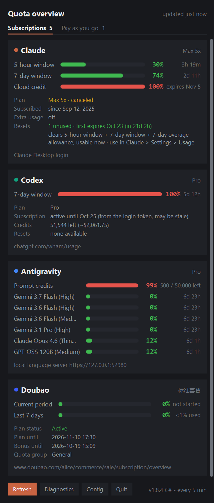
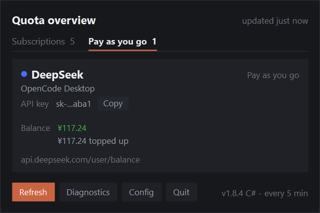

<h1 align="center">QuotaTray</h1>

  Windows 托盘小程序：一键查看 AI 编程工具的额度和 API 余额。 
  <b>Claude</b> · <b>Codex</b> · <b>Antigravity</b> · <b>Gemini CLI</b> · <b>TRAE</b> · <b>Doubao</b> · <b>DeepSeek</b> 

  
  
  
  

<table>
  <tr>
    <th>订阅制</th>
    <th>按量计费</th>
  </tr>
  <tr>
    <td align="center" valign="top">
       
      额度窗口、重置时间、套餐与账号信息
    </td>
    <td align="center" valign="top">
       
      DeepSeek API 余额，支持复制 Key
    </td>
  </tr>
</table>

**中文** · [English](README.en.md)

## 功能概览

- 在一个面板中查看 Claude、Codex、Antigravity、TRAE、豆包的用量，以及 DeepSeek API 余额。
- 显示额度窗口、重置倒计时、套餐、积分和多账号；提醒尚未使用的一次性额度重置。
- 读取本机工具已有的登录凭据，无需在 QuotaTray 内重新登录。
- 支持 Windows 开机自启、托盘菜单刷新和一键更新。Gemini CLI 卡片默认关闭。

## 快速开始

1. 从 [最新 Release](https://github.com/yhm138/ai-quota-tray/releases/latest) 下载 **`QuotaTray-<版本>-csharp-windows-anycpu.exe`**。C# 版约 250 KB，使用 Windows 10（1903+）/11 自带的 .NET Framework 4.8，支持 x64 和 ARM64。
2. 将文件放到固定位置（例如 `C:\Tools\QuotaTray\`），再双击运行。首次启动会记录开机自启路径。
3. 点击通知区域中的图标打开面板；若看不到图标，展开任务栏的 `^` 菜单。请先在对应工具中完成登录；Antigravity 需要保持 IDE 运行。

Python 版提供单文件 exe 和便携 zip，保留额外的 Claude cookie 与 Codex SQLite 兜底路径。两个版本共用 `%APPDATA%\QuotaTray` 设置，同一时间只运行一个实例。

Release 二进制未签名，可能被杀软拦截。安装前可核对同一 Release 的 SHA256 校验文件；详细下载选择、校验及源码安装见 [使用指南](docs/user-guide.md#安装)。

## 文档导航

| 文档 | 内容 |
|---|---|
| [使用指南](docs/user-guide.md) | 安装、套餐与重置、更新、配置、排错、隐私和已知限制 |
| [数据来源](docs/providers.md) | 各产品的凭据位置、查询接口、兜底顺序和特殊设置 |
| [开发指南](docs/development.md) | 环境准备、仓库结构、版本差异、脚本、测试与发布 |
| [更新记录](CHANGELOG.md) | 各版本的变更 |

## 许可证

MIT，见 [LICENSE](LICENSE)。
